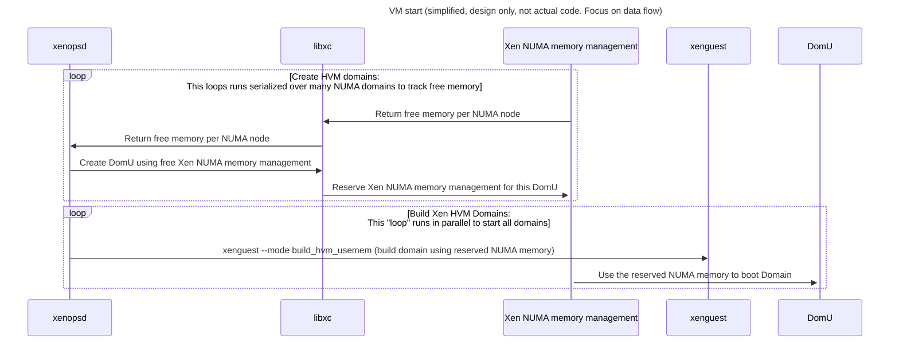

# NUMA-aware memory allocation

## Plan for optimizing NUMA memory performance

### New Hypercall to create a domain and its data structures on a NUMA node

Add a libxc call (and hypercall) to create a Xen Domain for one NUMA node.

The hypervisor's data structures are allocated on this NUMA node.

Example data structures with impact on performance:
- pages tables for virtual addresses of applications in Xen domains
- vCPU data: execution context of the vCPU (register state, etc)

### Analysis on using the set_nodeaffinty hypercall to set node affinity

The hypercall[`XEN_DOMCTL_setnodeaffinity`](set_nodeaffinity.md) can be used
to switch between auto_affinity using vCPU affinity and manual affinity.

### Updating the hypercall to create/update the outstanding claim for memory

WIP

### New Hypercall to claim Xen Domain memory on NUMA nodes

Add a libxc call (and hypercall) to claim(reserve) memory for NUMA nodes.

That will be a dependency to fix the race with a new NUMA/Toolstack design:

See the new design documentation on [`xenguest`](x86/xenguest_boot.md) HVM boot
and [`meminit_hvm()`](x86/meminit_hvm.md) for the details of the current code
and how it is planned to allocate Xen Domain memory from NUMA nodes.

## Background information on domain creation

### Other memory allocations for domains

- The hvmloader also allocates memory, but does so only using 4k pages
  for ACPI info tables etc, so the amount and performance impact should be low.

## Other memory that is not yet allocated in a NUMA-aware manner

- The domain struct: The global data structure for all Domain information
- vCPU state data structures: These are accessed whenever a vCPU changes (e.g vCPU context switch)
- Shadow/Guest page tables: These are needed whenever a guest virtual page fault occurs.

## References
### ACPI Specification
#### ACPI System Description Tables
- 5.2.16. [System Resource Affinity Table (SRAT)](https://uefi.org/specs/ACPI/6.5_A/05_ACPI_Software_Programming_Model.html#system-resource-affinity-table-srat)
- 5.2.17. [System Locality Information Table (SLIT)](https://uefi.org/specs/ACPI/6.5_A/05_ACPI_Software_Programming_Model.html#system-locality-information-table-slit)
#### Device Configuration Objects
- 6.2.15. [System Locality Information (_SLI)](https://uefi.org/specs/ACPI/6.5_A/06_Device_Configuration.html#sli-system-locality-information)